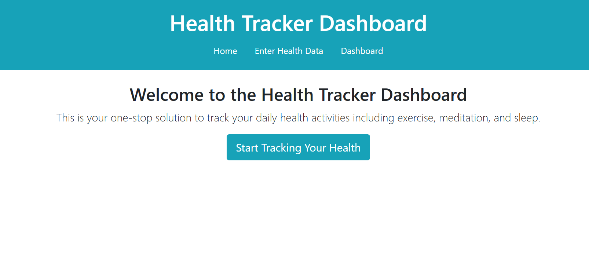
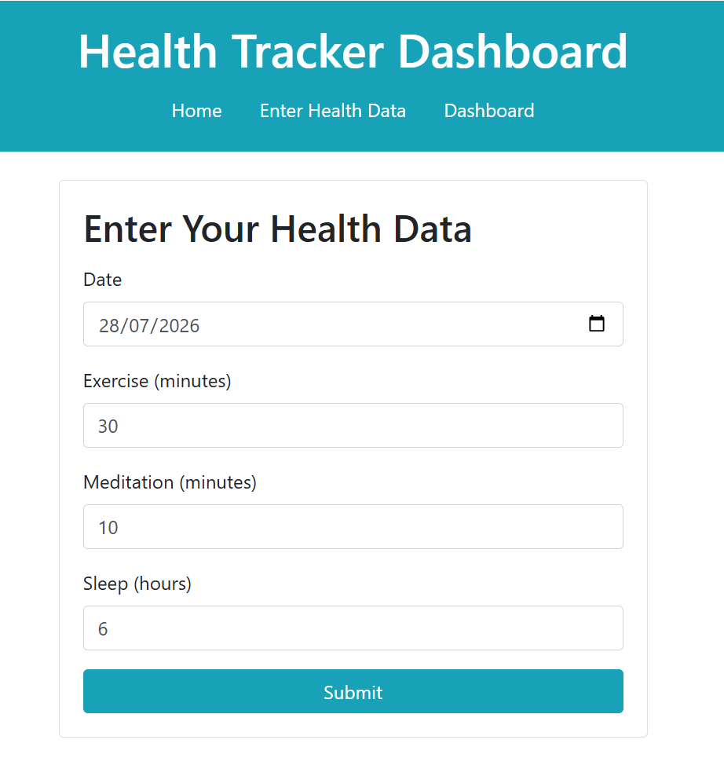
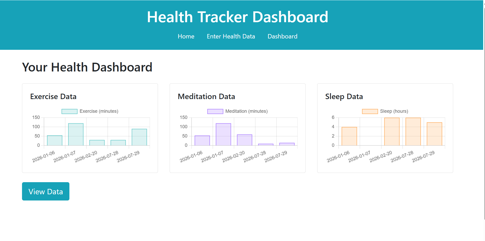
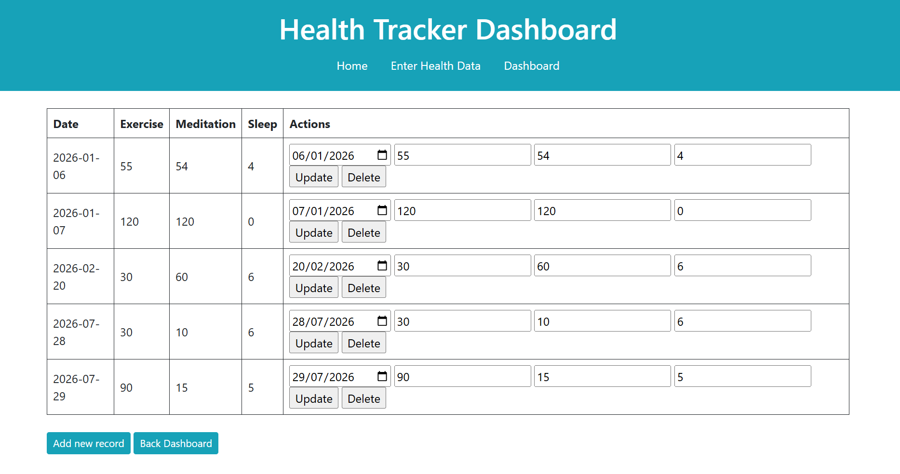

# Health Tracker Dashboard

A simple, clean web app for tracking your daily health habits — exercise, meditation, and sleep — with visual charts to see your progress over time.

Built with **Flask** (Python), this project lets you log daily entries, view them in an editable table, and visualize trends on an interactive dashboard.

---

## Features

- **Home page** — quick overview and entry point into the app
- **Enter Health Data** — log exercise (minutes), meditation (minutes), and sleep (hours) for any date
- **Dashboard** — bar charts visualizing exercise, meditation, and sleep data across recorded dates
- **Data table** — view, update, or delete any previously logged entry

---

## Screenshots

### Home


### Enter Health Data


### Dashboard


### Data Table


---

## Tech Stack

- **Backend:** Python, Flask
- **Frontend:** HTML, CSS, JavaScript (charts)
- **Environment:** Python virtual environment (`venv`)

---

## Getting Started

These steps will get a local copy running on your machine.

### 1. Clone the repository

```bash
git clone https://github.com/Mahmoud-KM/Health-Tracker-Dashboard.git
cd Health-Tracker-Dashboard
```

### 2. Create a virtual environment

```bash
python -m venv venv
```

### 3. Activate it

**Windows:**
```bash
venv\Scripts\activate
```

**Mac/Linux:**
```bash
source venv/bin/activate
```

### 4. Install dependencies

```bash
pip install -r requirements.txt
```

### 5. Run the app

```bash
python code/app.py
```

Then open your browser to `http://127.0.0.1:5000` (or whichever port Flask reports).

---

## Project Structure

```
Health-Tracker-Dashboard/
├── code/                 # Application source code
├── images/               # Images used in this README
├── requirements.txt      # Python dependencies
├── .gitignore
└── README.md
```

---

## About This Project

This app was built as a hands-on practice project while following the LinkedIn Learning course [Build a Full Stack App in Python with Flask](https://www.linkedin.com/learning/flask-essential-training-24681038/build-a-full-stack-app-in-python-with-flask).

### Key Concepts Covered

- **Flask Routing & Views** — defining routes, building view functions, working with URL parameters
- **Jinja Templating** — rendering dynamic HTML with Jinja, using template inheritance for consistent layouts
- **Database Operations with SQLAlchemy** — setting up SQLAlchemy, creating models, and implementing create, read, update, and delete (CRUD) operations
- **Data Visualization** — seeding a database and generating charts from live data
- **Deployment** — preparing and deploying the finished app to Vercel

## About This Project

This app was built as a practice project while following the LinkedIn Learning course [**Flask Essential Training: Build a Full Stack App in Python with Flask**](https://www.linkedin.com/learning/flask-essential-training-24681038/build-a-full-stack-app-in-python-with-flask).

It served as a hands-on way to learn and apply core Flask concepts, including:

- **Routing & Views** — defining routes, building view functions, and handling URL parameters
- **Jinja Templating** — rendering dynamic HTML with Jinja, and using template inheritance to keep pages consistent
- **Database Operations with SQLAlchemy** — setting up SQLAlchemy, creating models, and implementing create, read, update, and delete (CRUD) operations backed by SQLite
- **Data Visualization** — seeding a database and generating charts from live data
- **Deployment** — preparing and deploying the finished app to Vercel

---

## License

Copyright Notice and Usage Terms

Copyright (c) 2026 [SOILIHI CHEIKH MOUSSA MAHMOUD]

This is a personal project, built for learning purposes while following a
course on LinkedIn Learning. It is shared publicly in this repository for
personal reference and to support knowledge-sharing with others who may
find it useful.

You are not required or expected to use this code for any purpose. If you
do choose to reference, use, or build upon this work, attribution to the
original author (me) is appreciated, though not strictly required.

This software is provided "as is," without warranty of any kind, express
or implied. The author and LinkedIn are not responsible for any damage,
loss, or liability arising from the use of this work.
